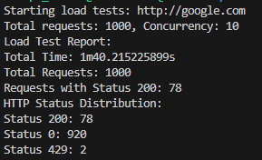

# StressTestCLI-Go

This repository is a CLI System developed in Golang as a partial assessment for the completion of the Postgraduate Degree in Golang.

In this work, concepts such as CLI with Cobra-CLI, Docker, Go Routines and External API calls are utilized.

## Configuration
Build the application
```sh
docker build -t stresstester .
```
Run the test
```sh
docker run stresstester run --url=http://google.com --requests=1000 --concurrency=10
```
Wait the response



